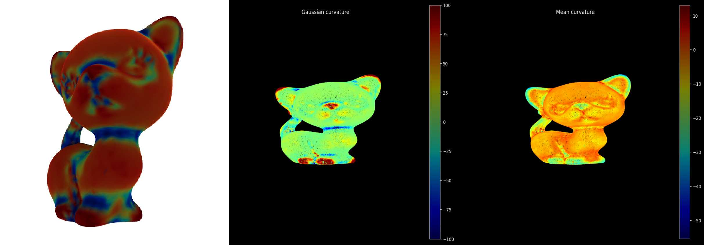

# Torch3D_Curvature

`Torch3D_Curvature` is a complement and correction to the `PyTorch3D` library, created by Yihao Luo. It provides elegant and efficient methods to compute the curvature for both a mesh or point cloud and relevant algorithms about computational geometry using `PyTorch`.



## Functions 

- Compute the Gaussian curvature of triangular meshes by discrete Gauss-Bonnet theorem
- Compute the Gaussian and Mean curvature of Pointclouds by estimating the Gaussian map and its differential map, the Weingarten map, in some computational ways.
-  Some conceptual mistakes in `PyTorch3D` are corrected in this 
  project. For example, `pytorch3d.ops.estimate_pointcloud_local_coord_frames` provides a wrong frame based on the local covariance of each point in a Pointcloud. For example, the eigenvector corresponding to the minimal eigenvalue of covariance is exactly the normal vector, but neither other two eigenvalues are principal curvatures. `Torch3D_Curvature.ops.pcl_curvature.Curvature_pcl` provides the correct version by computing the eigenvector of the Weingarten map got from `Torch3D_Curvature.ops.pcl_curvature.Weingarten_maps`.

- Codes contain methods for the computation of numerical topological characteristics with gradients.
- Efficient computation using PyTorch tensors, supporting calculations with CUDA 

Please run the tutorial notebook ```TUTORIAL.ipynb``` for guidance in detail.
  
## Requirment

PyTorch3D Curvature requires PyTorch and PyTorch3D to be installed. If you haven't installed them yet, you can install them using the following commands:

```shell
pip install torch torchvision
pip install pytorch3d
```


## Usage Example 

#### For Mesh

```Python
import numpy as np
from pytorch3d.io import load_obj
from pytorch3d.structures import Meshes

from ops.mesh_curvature import Gaussian_curvature, 
Dual_area_for_vertices, Average_from_verts_to_face

# Load the kitty mesh.
trg_obj = 'kitty.obj'

# We read the target 3D model using load_obj
verts, faces, aux = load_obj(trg_obj)
faces_idx = faces.verts_idx
verts = verts

# We construct a Meshes structure for the target mesh
trg_mesh = Meshes(verts=[verts], faces=[faces_idx])

# Dual areas of he vertices
dual_area_vertex = Dual_area_for_vertices(trg_mesh)

# gaussian curvature of the vertices and topological characteristics
gaussian_curvature, Euler_chara, Genus = Gaussian_curvature(trg_mesh,return_topology=True)

# gaussian curvature of the faces with weights of Dual areas
gaussian_curvature_faces = Average_from_verts_to_face(trg_mesh,gaussian_curvature.T).cpu().numpy()

# discrete Gauss-Bonnet theorem
print("Gauss-Bonnet theorem: integral of gaussian_curvature - 2*pi*X = ",(gaussian_curvature*dual_area_vertex).sum().cpu().numpy() - 2*np.pi*mesh_np.euler_number)
```
The result print as follows
```Python
"Gauss-Bonnet theorem: integral of gaussian_curvature - 2*pi*X =  0.000017"
```

#### For PointCloud

```Python
pointscloud = sample_points_from_meshes(trg_mesh, 100000)

k = 50 # number of nearest neighbors
Weingarten_fields, normals_field, tangent1_field, tangent2_field = Weingarten_maps(pointscloud,k)

# construct the principal frame by principal curved directions and normals
principal_curvatures, principal_direction, normals_field =  Curvature_pcl(pointscloud,k,return_princpals=True)
principal_frame = torch.cat([principal_direction,normals_field[:,:,None,:]],dim=-2)
```
The computational results are presented in the above image. 

## Mathematical Foundation

The Gaussian map is a mapping that transforms each point on a surface to a point on the unit sphere. The Weingarten map, the differential of the Gaussian map, transforms each tangent vector on a surface to the tangent vector of the unit sphere linearly. Due to the two tangent spaces coinciding, the Weingarten map can be represented as a $2\times2$ matrix field.  The curvature at a point on the surface can be computed using the Weingarten map as follows:

Let $N:M\to S^2$ be the unit normal vector at the point.
Let $dN: T_p(M)\to T_{N(p)}S^2$ be Weingarten map, written as $W(p)$.
The Gaussian curvature can then be computed as $K_p = \det(W(p))$ and the Mean curvature equals to $H_p = {\frac{1}{2}}{\rm Tr}(W(p))$.

The Gauss-Bonnet theorem unveils the deep connection between the local geometry and global topology, which says the integral of Gaussian curvature giving the Euler characteristics of a closed surface: 
$$\int_M KdA = 2\pi* \chi$$


## Contact Information
If you have any questions or feedback, you can contact the project maintainer @Luo-Yihao by email y.luo23@imperial.ac.uk

